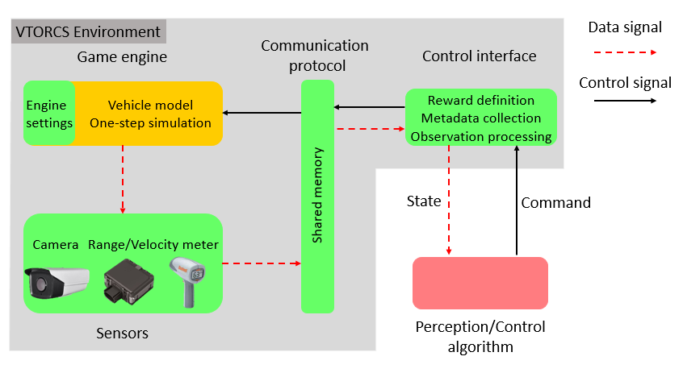

# VTORCS Simulator and Videos
The VTORCS introduction and the experiment videos.

## VTORCS Introduction
The system diagram of VTORCS is shown below:
The simulator consists of four ingredients: a game engine block, a sensors block, a communication protocol block, and a control interface block.\
The working flow includes two signal streams. In the data signal stream, the sensors firstly collect the measurement from the game engine and write all the data to shared memory via the communication protocol. The control interface then reads these data, assembles the observation, finally sends it to the external perception/control algorithm. In the control signal stream, the external algorithm computes and sends the control command to the control interface which will write the command to shared memory. Finally, the game engine reads the command from the communication protocol and finishes the one-step simulation.

## Video for Experiments
The video includes four experiments. The experiment configuration is detailed as follows. \
**Experiment 1** \
RL controller with ground-truth input. The track is alpine-2 with _one_ lane. \
**Experiment 2** \
MTL-RL controller with visual input. The track is g-track-3 with _one_ lane. \
**Experiment 3** \
MTL-RL controller with ground-truth input. The track is alpine-1 with _three_ lane. \
**Experiment 4** \
MTL-RL controller with ground-truth input. The track is e-track-2 with _two_ lane. A traffic car is running in the left lane.

**Video link:** [Youtube](https://youtu.be/RKeepKwkQhg)